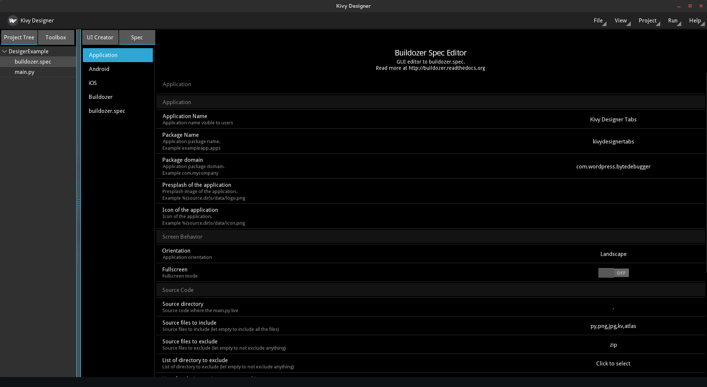

Buildozer Spec Editor
=====================

Kivy Designer provides a GUI editor to Buildozer Spec files.

Settings
~~~~~~~~

You can edit Buildozer Settings at ``File -> Settings -> Buildozer``.
You may see the following keys:

* **Buildozer Path** - indicates the path of Buildozer executable. Kivy Designer finds it automatically if it's on the system path.
* **Create buildozer.spec automatically** - This option allow Kivy Designer to create a basic spec while creating a new project.

Creating a new Buildozer Project
~~~~~~~~~~~~~~~~~~~~~~~~~~~~~~~~

If you want to make your project compatible with Buildozer, creates a new specification file on ``Tools -> Buildozer init``
This command will create a basic buildozer.spec file on the root folder of your project.

Editing
~~~~~~~

To open Buildozer Spec editor, just click on the ``buildozer.spec`` file in the **Project Tree**.

GUI
---

You will see the Editor with the project's settings.

You can edit the specifications using the GUI editor. You can find some shortcuts to usual settings.

You'll see the default values for Android Permissions, Garden requirements and Python module dependencies; and you'll be able to add your own value if necessary.

Raw Editor
----------

If you prefer, you can edit the spec in text mode. Just open the **buildozer.spec** tab in the Editor and you'll see a text input to edit it.

Save your new specification
---------------------------

If you are using the GUI, it'll auto save your spec. If using the raw editor, you need to press **Apply modifications** to save it; or **Cancel modifications** to restore the last saved .spec
