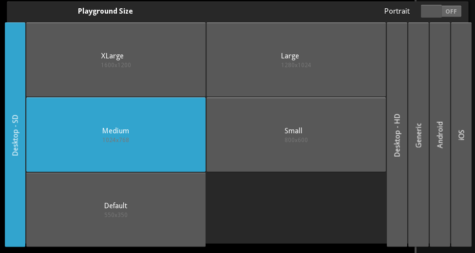
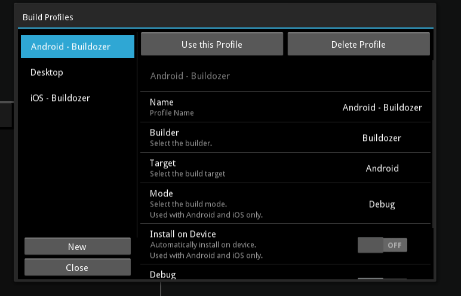

Quick-start
===========

Let's know more about Kivy Designer!

How it works
------------

Kivy Designer organizes some open source tools to help you to create Kivy UI easily, develop your applications and target multiple platforms.

Creating a new project
~~~~~~~~~~~~~~~~~~~~~~

To create a new project, you can use:
    * In **Start Page**, there is a ``New Project`` button.
    * In the menu ``File -> New Project``

This is the **New Project** wizard:

.. image:: img/kd_new_project.png

Where you can select an initial template for your project.

After creating it, you'll see the UI Creator. You can start editing the app UI, or edit the ``main.py``.

Kivy Designer Interface
-----------------------

This is a list and overview of some Kivy Designer's components

After opening a project, you will see following:
    1. **Project Tree** on the left side, shows files and folders inside the project's directory.
    2. **Toolbox** contains widgets which could be drag-drop to the required positions.
    3. **UI Creator** is place where you will be designing your project.
    4. **Widget Tree** shows the Widget hierarchy of the project.
    5. **Property Viewer** shows properties, their values and allows changing the values.
    6. **Events** shows the available events and their event handler. You can change/set an event handler and add an event.
    7. **KV Lang Area** shows what your kv file would be consisting.
    8. **Kivy Console** is a console just like xterm, GNOME Terminal. You can enter commands and execute them.
    9. **Python Shell** is an interactive Python Shell.
    10. **Error Console** shows errors which may occur in the user code, while opening a project or creating custom widget.
    11. **Playground Settings** you can change the playground screen size, orientation and zoom to help the UI development
    12. **Status Bar** The status bar helps you displaying the selected widget hierarchy and messages.

.. image:: img/kd_interface.png

UI Creator
----------

You'll probably spend a big part of your time designing the app interface; so the UI creator is the right place for you :)

When designing the UI, you can get Widget from **Widget Tree** or you insert the KV Lang code in **KV Lang Area**

If you want to change the size or orientaiton of the emulated interface, you can set it on **Playground Settings**

Building
--------

To build, and run your project, you'll need to configure the Kivy Designer Builder. The Builder will help you to target your application to the desired platforms.
You can access Builder settings at ``Run -> Edit Profiles...``

.. _Builder:

Builders
~~~~~~~~
You can use the following tools to build your project:

    * **Desktop** - This is the default Python interpreter available in your system. (Desktop only)
    * **Buildozer** - Use `Buildozer <http://buildozer.readthedocs.org/>`_ to target mobile devices. (Android and iOS)
    * **Hanga** - Use Hanga to target mobile devices. (Android)

Build Profiles
~~~~~~~~~~~~~~
You can select and configure your Builder using Build Profiles. 

Kivy Designer already provides 3 defaults profiles:

    * Desktop
    * Android - Buildozer
    * iOS - Buildozer

You can edit/delete these profiles and create new ones. To use a profile, click in the button ``Use this profile`` or select the profile from the menu ``Run -> Select Profile``

Editing a profile
~~~~~~~~~~~~~~~~~

Before edit a build profile, it's a good idea to know what you are editing :) Take a look on what each field represents

    * **Name** - Name of the profile. This name will be visible in the profiles list.
    * **Builder** - Select which Builder_ do you want to use.
    * **Target** - Select the target platform. IMPORTANT: Just make sure that the selected Builder_ supports the desired platform.
    * **Mode** - Used by Buildozer and Hanga only. This sets the build mode, Debug or Release.
    * **Install On Device** - If you are targeting a mobile device, this tool allows you to auto install the application every build.
    * **Debug** - If activated and targeting Android, will show the logcat output on Kivy Console.
    * **Verbose** - If activated, will run your Builder_ on verbose mode.

Run
~~~

The ``Run`` menu provides you some options. Take a look in the table bellow to see how it works with each Builder_

+-----------+---------------------------------------+--------------------------------------------+------------------------------------------+
|           | **Desktop**                           | **Buildozer**                              | **Hanga**                                |
+-----------+---------------------------------------+--------------------------------------------+------------------------------------------+
| **Run**   | Run *main.py* with Python interpreter | Build, install and run on target device    | Not yet implemented                      |
+-----------+---------------------------------------+--------------------------------------------+------------------------------------------+
| **Stop**  | Stop the Python interpreter           | Nothing                                    | Not yet implemented                      |
+-----------+---------------------------------------+--------------------------------------------+------------------------------------------+
| **Clean** | Removes all .pyc and __pycache__      | Clean the Buildozer build                  | Not yet implemented                      |
+-----------+---------------------------------------+--------------------------------------------+------------------------------------------+
| **Build** | Generate .pyc                         | Build the project. If ``Install On Device``| Not yet implemented                      |
|           |                                       | is set, install it on device.              |                                          |
+-----------+---------------------------------------+--------------------------------------------+------------------------------------------+
|**Rebuild**| Run ``Clean`` and the ``Build``       | Run ``Clean`` and the ``Build``            | Not yet implemented                      |
+-----------+---------------------------------------+--------------------------------------------+------------------------------------------+

Modules
-------

While developing your application, Kivy provides some `extra modules <http://kivy.org/docs/api-kivy.modules.html>`_ to help you.

Kivy Designer has an interface to some of `these modules <http://kivy.org/docs/api-kivy.modules.html>`_ .

To use Kivy Modules you must target Desktop, select the desired module at ``Run -> Run with module...``.

Screen Emulation
~~~~~~~~~~~~~~~~

It's really important to see your application running in different screen sizes, dimensions and orientations.

Kivy Designer provides a simple interface to the `Screen Module <http://kivy.org/docs/api-kivy.modules.screen.html#module-kivy.modules.screen>`_.

This module provides some settings. You can change the ``Device``, ``Orientation`` and ``Scale``. And the just press ``Run`` to run your application with Screen Module.

Touchring
~~~~~~~~~

The `Touchring Module <http://kivy.org/docs/api-kivy.modules.touchring.html#module-kivy.modules.touchring>`_ shows rings around every touch on the surface / screen.

You can use this module to check that you don’t have any calibration issues with touches.

Monitor
~~~~~~~

The `Monitor Module <http://kivy.org/docs/api-kivy.modules.monitor.html#module-kivy.modules.monitor>`_ is a toolbar that shows the activity of your current application.

Inspector
~~~~~~~~~

.. note::
    `This module is highly experimental, use it with care.`

The `Inspector Module <http://kivy.org/docs/api-kivy.modules.inspector.html#module-kivy.modules.inspector>`_ is a tool for finding a widget in the widget tree by clicking or tapping on it.

After running your app, you can access the Inspector with:

    - "Ctrl + e": activate / deactivate the inspector view
    - "Escape": cancel widget lookup first, then hide the inspector view

Available inspector interactions:

    - tap once on a widget to select it without leaving inspect mode
    - double tap on a widget to select and leave inspect mode (then you can manipulate the widget again)

.. warning::
    Some properties can be edited live. However, due to the delayed usage of some properties, it might crash if you don’t handle all the cases.

Web Debugger
~~~~~~~~~~~~

The `Web Debugger Module <http://kivy.org/docs/api-kivy.modules.webdebugger.html#module-kivy.modules.webdebugger>`_ starts a webserver and run in the background. You can see how your application evolves during runtime, examine the internal cache etc.

To access the debugger, Kivy Designer will open http://localhost:5000/