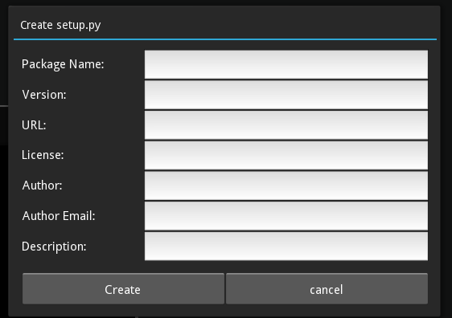
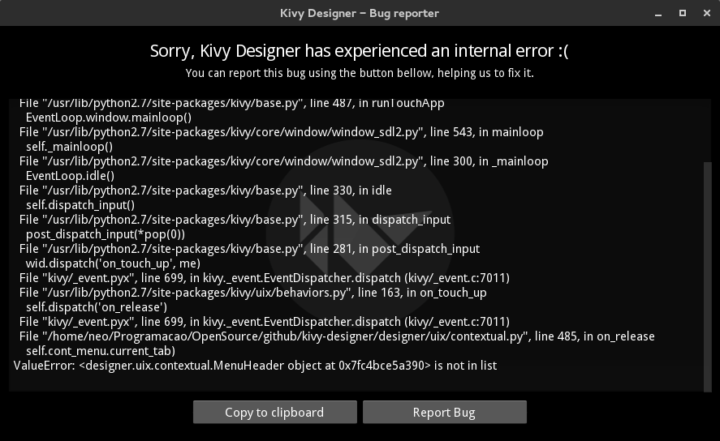

Kivy Designer's Tools
=====================

This section explain how to use Kivy Designer's tools. Each tool tries to simplify a process of the development. 

Create setup.py
---------------

This is a helper to auto create a setup.py file in the root of the project.

You can access it in the menu ``Tools -> Create setup.py``

Check PEP8
----------

This tool will check the PEP8 of the current project. It's run on Kivy Console, so you need to check the Kivy Console to see the PEP8 checker status.

Export .PNG
-----------

This is a helper to create a .png image from the Kivy Designer's Playground. While developing an application, if you want to save your current design in a image, use  ``Tools -> Export .PNG``

If there is a selected widget on Playground, this widget will be exported. If there is no selected widget, the RootWidget will be exported.

The .png will be saved in the root folder of the project, and the file name will be displayed on the Status Bar.

Git
---

Kivy Designer provides some Git shortcuts to help you with your project versioning. You can get Git tools on ``Tools -> Git``

If the project is not a git repo, you will see the ``Init`` button. Otherwise, you'll have the following tools available.

Commit
~~~~~~
Commit the current repository.

Add
~~~
Opens a list with untracked files. You can select the desired files to add to the Git repo.

Branches
~~~~~~~~
Opens a list with repo branches. You can select any branch to do a checkout. Or you can type a custom name and select it to create a new branch and do checkout to it.

Diff
~~~~
Shows the project's modification on a Code Input

Pull/Push
~~~~~~~~~

To work with remote repositories, you'll need to generate and configure a SSH key. `Read more about it here. <https://help.github.com/articles/generating-ssh-keys>`_

If you have a SSH key working, you can pull and push data from remote repositories. These buttons will display a list of available remotes. Select a remote to pull or push data.

.. note::

    If you are using Windows, you may see a CMD window asking for SSH password before remote actions.

Bug Reporter
------------
We hope that you never use this tool, but let's know about it.

If Kivy Designer finds a bug, you'll see the following screen:

The  ``Copy to clipboard`` button copies the traceback message to the clipboard. 

And if you want to help us to fix it, the ``Report Bug`` button will open a Github page to submit this issue. 